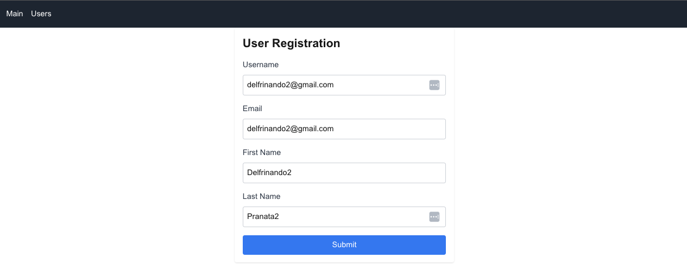

# Next.js + MongoDB + Tailwind CSS Project

This is a full-stack project built with [Next.js](https://nextjs.org/), [MongoDB](https://www.mongodb.com/), and [Tailwind CSS](https://tailwindcss.com/). It includes user registration functionality, displays a list of users from a MongoDB database, and is styled with Tailwind CSS for responsive design.

## Features

- **User Registration Form**: Users can enter their details and register via a form.
- **User Listing**: Displays all registered users in a table fetched from MongoDB.
- **Styled with Tailwind CSS**: The app is styled using utility classes for easy customization.
- **Light/Dark Mode**: The project uses custom CSS variables to support light and dark themes based on system preferences.

## Technologies Used

- **Frontend**: [Next.js](https://nextjs.org/) with React
- **Database**: [MongoDB](https://www.mongodb.com/)
- **Styling**: [Tailwind CSS](https://tailwindcss.com/)
- **State Management**: React `useState`, `useEffect` hooks
- **API Routes**: Next.js API routes for MongoDB operations

## Installation and Setup

### Prerequisites

- Node.js (v14+ recommended)
- MongoDB (local or MongoDB Atlas)

### Installation

1. Clone the repository:

   ```bash
   git clone https://github.com/delfrinandopranata/next-tailwind-ubiquitous/
   cd next-tailwind-ubiquitous
   ```

2. Install dependencies:

   ```bash
   npm install
   ```

3. Configure MongoDB:
   - If using a local MongoDB instance, ensure it's running.
   - If using MongoDB Atlas, set up a cluster and get your MongoDB connection string.
   - Create a `.env.local` file in the root directory and add your MongoDB URI:

   ```bash
   MONGO_URI=mongodb://localhost:27017/myapp
   ```

   Or for MongoDB Atlas:

   ```bash
   MONGO_URI=mongodb+srv://<username>:<password>@<cluster-url>/myapp
   ```

4. Start the development server:

   ```bash
   npm run dev
   ```

5. Open your browser and visit `http://localhost:3000`.

### Build for Production

To build the project for production, run:

```bash
npm run build
npm run start
```

## Project Structure

- `/components`: Contains reusable components such as `Navbar` and `UserForm`.
- `/pages`: Contains all the pages, including the homepage and users list.
- `/pages/api`: Contains Next.js API routes for handling server-side logic, such as registering users and fetching users.
- `/models`: Contains Mongoose models for MongoDB (e.g., `User`).
- `/public`: Contains static assets like images and fonts.
- `/styles`: Contains global styles, including `globals.css` for Tailwind CSS and custom global styles.

## API Endpoints

- `POST /api/registerUser`: Registers a new user and stores their information in MongoDB.
- `GET /api/getUsers`: Fetches all registered users from MongoDB.

### Example Response for `/api/getUsers`

```json
[
  {
    "_id": "670a8cb1fa7f17f18314109d",
    "username": "delfrinando",
    "email": "delfrinando@gmail.com",
    "firstName": "Delfrinando",
    "lastName": "Pranata",
    "createdAt": "2024-10-12T14:50:25.799Z",
    "updatedAt": "2024-10-12T14:50:25.799Z",
    "__v": 0
  }
]
```




## Tailwind CSS Configuration

Tailwind CSS is configured in `tailwind.config.ts`. The project uses Tailwind's utility-first CSS classes to style components. Global styles are applied through `globals.css`.

## Scripts

- `npm run dev`: Runs the app in development mode.
- `npm run build`: Builds the app for production.
- `npm run start`: Starts the production build.
- `npm run lint`: Runs ESLint to analyze code for potential errors.

## Troubleshooting

- **MongoDB Connection Issues**: Ensure MongoDB is running locally or verify the connection string for MongoDB Atlas.
- **CSS Not Applied**: Check that `globals.css` is imported in `layout.tsx` and that Tailwind is correctly set up in `tailwind.config.ts`.

## License

This project is licensed under the MIT License.